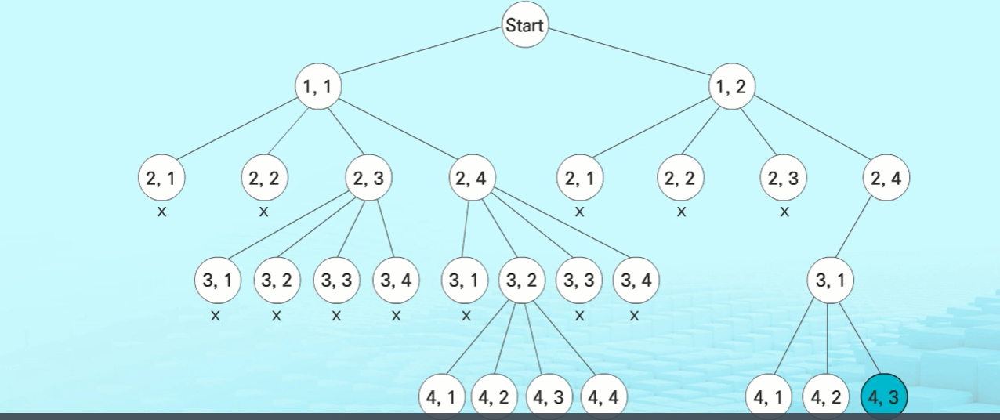

# 0831 Stack 2

## 스택1 개요

### 계산기

---

* 문자열로 된 계산식이 주어질 때, 스택을 이용하여 이 계산식의 값을 계산할 수 있다.

* 문자열 수식 계산의 일반적 방법

  * step1. 중위 표기법의 수식을 후위 표기법으로 변경 [스택]
  * step2. 후위 표기법의 수식을 스택을 이용하여 계산

  ```
  중위표기법
  - 연산자를 피연산자의 가운데 표기하는 방법
    예) A+B
  
  후위표기법
  - 연산자를 피연산자 뒤에 표기하는 방법
    예) AB+
  ```

* step1. 중위 표기식의 후위표기식 변환 방법1

  * 수식의 각 연산자에 대하여 우선순위에 따라 괄호를 사용하여 다시 표현

  * 각 연산자를 그에 대응하는 오른쪽괄호의 뒤로 이동

  * 괄호를 제거

    ```
    예) A*B-C/D
    1단계: ((A*B)-(C/D))
    2단계: ((AB)*(CD)/)-
    3단계: AB*CD/-
    ```

* step1. 중위 표기법에서 후위 표기법으로의 변환 알고리즘(스택)

  * 입력 받은 중위 표기식에서 토큰을 읽는다
  * 토큰이 피연산자이면 토큰을 추력한다
  * 토큰이 연산자(괄호포함)일 때, 
    * 이 토큰이 스택의 top에 저장되어 있는 연산자보다 우선순위가 높으면 스택에 push하고, 
    * 그렇지 않다면 스택 top의 연산자의 우선순위가 토큰의 우선순위보다 작을 떄까지 스택에서 pop한 후 토큰의 연산자를 push한다. 
    * 만약, top에 연산자가 없으면 push한다.
  * 토큰이 오른쪽 괄호 ')'이면
    * 스택 top에 왼쪽 괄호 '('가 올 때까지 스택에 pop 연산을 수행하고 
    * pop한 연산자를 출력한다. 
    * 왼쪽 괄호를 만나면 pop만 하고 출력하지는 않는다.
  * 중위 표기식에 더 읽을 것이 없다면 중지하고, 더 읽을 것이 있다면 1부터 다시 반복한다.
  * 스택에 남아 있는 연산자를 모두 pop하여 출력한다.
    * 스택 밖의 왼쪽 괄호는 우선 순위가 가장 높으며, 
      스택 안의 왼쪽 괄호는 우선 순위가 가장 낮다.

* 예시

  * 스택 안에 우선순위 순서대로 쌓아준다

  * (6+5*(2-8)/2)

    1) 연산자 push, 피 연산자 print

    2) 토큰 우선순위 <= top 우선순위: pop
        토큰 우선순위 > top 우선순위: push

    3) ')' -> '('까지 pop

    4) '('는 밖에 있을 떄 우선순위가 높음

    

* step2. 후위 표기법의 수식을 스택을 이용하여 계산
  * 피연산자를 만나면 스택에 push한다.
    * 전처리는 기호를 push
    * 계산은 숫자를 push
  * 연산자를 만나면 필요한만큼의 피연산자를 스택에서 pop하여 연산하고, 연산 결과를 다시 스택에 push한다.
  * 수식이 끝나면, 마지막으로 스택을 pop하여 출력한다.

* 연산자 우선순위 [ 클수록 높음 ]

  * if (icp > isp): push()
    else: pop()

  | 토큰 | ISP  | ICP  |
  | ---- | ---- | ---- |
  | )    | -    | -    |
  | *, / | 2    | 2    |
  | +, - | 1    | 1    |
  | ()   | 0    | 3    |
  * '('의 경우 밖에서 쌓을 때는 언제나 push 할 수 있고
  * '('의 경우 TOP이면 항상 어떤 거든 받아들일 수 있음


* eval(수식)
  * 이 알고리즘을 적용함


### 백트래킹

---

* 백트래킹(Backtracking) 기법은 해를 찾는 도중에 '막히면'(즉, 해가 아니면) 되돌아가서 다시 해를 찾아 가는 기법이다
* 백트래킹 기법은 최적화(optimization)문제와 결정(decision)문제를 해결할 수 있다.
* 결정문제: 문제의 조건을 만족하는 해가 존재하는지의 여부를 'yes' 또는 'no'가 답하는 문제
  * 미로 찾기
  * n-Queen 문제
  * Map coloring
  * 부분 집합의 합(Subset Sum)문제 등
  
    

##### 미로찾기

* 입구와 출구가 주어진 미로에서 입구부터 출구깢의 경로를 찾는 문제
* 이동할 수 있는 방향은 4방향으로 제한

| 미로 | 0    | 1    | 2    | 3    | 4    | 5    | 6    | 7    |
| ---- | ---- | ---- | ---- | ---- | ---- | ---- | ---- | ---- |
| 0    | S    | 0    | 1    | 1    | 1    | 1    | 1    | 1    |
| 1    | 1    | 0    | 0    | 0    | 0    | 0    | 0    | 1    |
| 2    | 1    | 1    | 1    | 0    | 1    | 1    | 1    | 1    |
| 3    | 1    | 1    | 1    | 0    | 1    | 1    | 1    | 1    |
| 4    | 1    | 0    | 0    | 0    | 0    | 0    | 0    | 1    |
| 5    | 1    | 0    | 1    | 1    | 1    | 1    | 1    | 1    |
| 6    | 1    | 0    | 0    | 0    | 0    | 0    | 0    | 0    |
| 7    | 1    | 1    | 1    | 1    | 1    | 1    | 1    | E    |

* 알고리즘
  * push (0,0), 오른쪽
  * push(0,1) ,아래쪽
  * push(1,1), 오른쪽
  * push(1,2), 오른쪽
  * push(1,3) , 오른쪽
    * push(1,4) 오른쪽
    * push(1,5)오른쪽
    * push(1,6)
    * pop(1,6)
    * pop(1,5)
    * pop(1,4)
  *  pop(1,3)오른쪽
  * push(1,3) 아래쪽
    * ...


##### 백트래킹과 깊이우선탐색과의 차이

> 백트래킹 = DFS  + 가지치기

| 백트래킹                                                     |
| ------------------------------------------------------------ |
| 어떤 노드에서 출발하는 경로가 해결책으로 이어질 것 같지 않으면 더 이상 그 경로를 따라가지 않음으로써 시도의 횟수를 줄임. |
| Prunning,가지치기                                            |
| 불필요한 경로의 조기 차단                                    |
| n!가지 경우의 수를 가진 문제에 대해 백트레킹에 가하면 일반적으로 경우의 수가 줄어든다 |
| 단, 최악의 경우 여전히 지수함수 시간(Exponential Time)을 요하므로 처리 불가능하다 (만능이 아니다) |

| 깊이 우선 탐색                                               |
| ------------------------------------------------------------ |
| 모든 경로를 추적                                             |
| N! 가지의 경우의 수를 가진 문제에 대해 깊이 우선 탐색을 가하면 처리 불가능한 문제 |
| 일반적으로10!까지는 구할 수 있다고 함                        |


##### 백트래킹

* 모든 후보를 검사?
  
  * No
  
* 백트래킹 기법
  * 어떤 노드의 유망성을 점검한 후에 유망(promising)하지 않다고 결정되면 그 노드의 부모로 되돌아가(backtracking) 다음 자식 노드로 감
  * 어떤 노드를 방문하였을 때 그 노드를 포함한 경로가 해답이 될 수 없으면 그 노드는 유망하지 않다고 하며
  * 반대로 해답의 가능성이 있으면 유망하다고 한다.
* 가지치기(prunning): 유망하지 않은 노드가 포함되는 경로는 더 이상 고려하지 않는다.
  
* 백트래킹 알고리즘의 절차
  * 상태 공간 트리의 깊이 우선 검색
  * 각 노드가 유망한지 점검
  * 만일 유망하지 않으면, 그 노드의 부모 노드로 돌아가서 검색을 계속함

* 일반 백트래킹 알고리즘

  * n - Queen
  * n*n의 정사각형 안에 n개의 queen을 배치하는 문제로,
  모든 queen은 자신의 일직선상 및 대각선상에 아무것도 놓이지 않아야 함

  ```python
  def checknode (v): #node
     	if promising(v):
          if there is a soution at v:
              write the solution
          else:
              for u in each child of v:
                  checknode(u)
  ```

  

* DFS로 할 시 최대 필요한 노드는
  
  * 좌표 4*4 기준으로
  * 초기 설정값 = 1,1 / 1,2 / 1,3 / 1,4
  * 원소가 4개가 4번의 깊이만큼 가야 하므로 4**4 = 256
  
* 깊이 우선 검색 vs 백트래킹
  
  * 순수 깊이 우선 검색: 155노드
  * 백트래킹: 27노드


#### 부분집합 구하기(POWERSET)

---

>  어떤 집합의 공집합과 자기자신을 포함한 모든 부분집합을 powerset 
>
>  >  구하고자 하는 어떤 집합의 원소 개수가 n일 경우 부분집합의 개수는 2**n이 나온다.

* 백트래킹 기법으로 powerset을 구해보자

  * 앞에서 설명한 일반적인 백트래킹 접근 방법을 이용한다
  * n개의 원소가 들어있는 집합의 2n개의 부분집합을 만들 때는, 
    True 또는 False 값을 가지는 항목들로 구성된 n개의 배열을 만드는 방법을 이용
  * 여기서 배열의 i번째 항목은 i번째의 원소가 부분집합의 값인지 아닌지를 나타내는 값이다.

* 재귀 호출 이용 부분집합 생성 알고리즘

  ```python
  A [] : 해당 원소 포함 여부를 저장(0,1)
  def powerset(n,k):     #n: 원소 갯수, k:현재 depth
      if n == k:         #Basis Part
          PRINT
      else:              #Inductive Part
          A[k] = 1       #k번 요소 포함
          powerset(n,k+1)#다음 요소 포함 여부 결정
          A[k] = 0       #k번 요소 미포함
          powerset(n,k+1)#다음 요소 포함 여부 결정
  ```

* 재귀 호출 이용 부분집합의 합

  ```python
  def printSet(n,sum):
      global count
      if sum == 10:
          for i in range(n):
              if A[i] == 1:
                  print("%d" %arr[i],end="")
          print()
  
  def powerset(n,k,cursum):
      global total
      if cursum > 10:return
  
      total += 1
      if n==k:
          printSet(n,cursum)
      else:
          A[k] = 1
          powerset(n,k+1,cursum + arr[k])
          A[k] = 0
          powerset(n,k+1,cursum)
          
  
  ```


#### 순열

* {1,2,3}을 포함하는 모든 순열 생성 (단순 loop)

  > n=10 초과인 경우 가지치기 필요함

  ```python
  for i1 in range(1,4):
      for i2 in range(1,4):
          if i2 != i1:
              for i3 in range(1,4):
                  if i3!=i1 and i3!=i2:
                      print(i1,i2,i3)
  ```

* 재귀 호출을 통한 순열

  ```python
  # arr[] : 데이터가 저장된 배열
  # swap(i,j): arr[i] <-- 교환 --< arr[j]
  # n:원소 개수, k: 교환 개수
  
  def perm(n,k):
      IF k == n:
          print(array) # 원하는 작업
      ELSE:
          FOR i in range(k,n): # k부터 n-1까지
              swap(k,i)         #앞자리 수 결정?
              perm(n,k+1)
              swap(k,i)       # 되돌려 놓기
  ```

  ```python
  arr= [1,2,3]
  
  perm(3,0) - swap(0,0) - perm(3,1) - swap(1,1) - perm(3,2) - swap(2,2) - perm(3,3) == print() - swap(2,2) - swap(1,1) - swap(2,1) - perm(3,2) - swap(2,2) - perm(3,3) == print() - swap(2,2) - swap(1,1) - ...
  ```

  ```python
  def perm(n,k):
      global cnt
      cnt += 1
      if n == k:
          print(arr)
      else:
          for i in range(k,n):
              print('{}번째 k={},i={}'.format(cnt,k,i))
              arr[k], arr[i] = arr[i], arr[k]
              perm(n,k+1)
              print('{}번째 k={},i={}'.format(cnt,k,i))
              arr[k], arr[i] = arr[i], arr[k]
  
  cnt = 0
  arr = [1,2,3]
  N = len(arr)
  perm(N,0)
  ```

  ```
  1번째 k=0,i=0
  [1, 2, 3]
  2번째 k=1,i=1
  [1, 2, 3]
  3번째 k=2,i=2
  [1, 2, 3]
  [1, 2, 3]
  4번째 k=2,i=2
  [1, 2, 3]
  4번째 k=1,i=1
  [1, 2, 3]
  4번째 k=1,i=2
  [1, 3, 2]
  5번째 k=2,i=2
  [1, 3, 2]
  [1, 3, 2]
  6번째 k=2,i=2
  [1, 3, 2]
  6번째 k=1,i=2
  [1, 2, 3]
  6번째 k=0,i=0
  [1, 2, 3]
  6번째 k=0,i=1
  [2, 1, 3]
  7번째 k=1,i=1
  [2, 1, 3]
  8번째 k=2,i=2
  [2, 1, 3]
  [2, 1, 3]
  9번째 k=2,i=2
  [2, 1, 3]
  9번째 k=1,i=1
  [2, 1, 3]
  9번째 k=1,i=2
  [2, 3, 1]
  10번째 k=2,i=2
  [2, 3, 1]
  [2, 3, 1]
  11번째 k=2,i=2
  [2, 3, 1]
  11번째 k=1,i=2
  [2, 1, 3]
  11번째 k=0,i=1
  [1, 2, 3]
  11번째 k=0,i=2
  [3, 2, 1]
  12번째 k=1,i=1
  [3, 2, 1]
  13번째 k=2,i=2
  [3, 2, 1]
  [3, 2, 1]
  14번째 k=2,i=2
  [3, 2, 1]
  14번째 k=1,i=1
  [3, 2, 1]
  14번째 k=1,i=2
  [3, 1, 2]
  15번째 k=2,i=2
  [3, 1, 2]
  [3, 1, 2]
  16번째 k=2,i=2
  [3, 1, 2]
  16번째 k=1,i=2
  [3, 2, 1]
  16번째 k=0,i=2
  [1, 2, 3]
  ```

  

#### 조합적 문제

> 재귀 + 가지치기
>
> > A형 문제에서는 이 개념들이 혼합하여 출제됨

* 부분집합
* 순열, 중복순열
* 조합, 중복조합


### 분할정복

---

* 설계전략

  * 분할

    * 해결할 문제를 여러 개의 작은 부분으로 나눔

  * 정복

    * 나눈 작은 문제를 각각 해결

  * 통합

    * (필요하다면 )해결된 해답을 모음

    

* 거듭 제곱 알고리즘(기본)

  * 시간 복잡도: O(n)

  ```python
  def Power(Base,Exponent):
      if Base == 0: return 1
      result = 1 # Base^0 은 1
      for i in range(Exponent):
          result *= Base
      return result
  ```

  ```
  Power(C,n)
  C2 = C X C
  C3 = C X C X C
  ...
  Cn = C X C X C ... X C
  ```

* 분할 정복 알고리즘(거듭제곱)

  * 시간복잡도: O(logn)

  ```python
  def Power(Base,Exponent):
      if Exponent == 0 or Base == 0:
          return 1
      if Exponent % 2 == 0:
          NewBase = Power(Base,Exponent//2)
          return NewBase * NewBase
     	else:
          NewBase = Power(Base,(Exponent-1)//2)
          return (NewBase * NewBase) * Base
  ```

  ```python
  Power(C,n)
  C**n = C**(n/2) * C**(n/2) # n은짝수
  C**n = C**((n-1)/2) * C**((n-1)/2) * C # n은 홀수
  ```


##### 분할정복 - 퀵정렬

|        | 합병정렬                                                | 퀵정렬                                                       |
| ------ | ------------------------------------------------------- | ------------------------------------------------------------ |
| 공통점 | 주어진 리스트를 두 개로 분할하고 각각 정렬한다          | 주어진 리스트를 두 개로 분할하고 각각 정렬한다               |
| 차이점 | 분할 시, 단순하게 두 부분으로 나눔                      | 분할 시, 기준 아이템(Pivot Item)을 중심으로, 이보자 작은 것은 왼편, 큰 것은 오른편에 위치 |
| 차이점 | 각 부분 정렬이 끝난 후, '합병'이란 후처리 작업이 필요함 | 각 부분 정렬이 끝난 후, 후처리 작업이 필요하지 않음          |

* 퀵정렬 알고리즘

  ```python
  def quickSort(a,begin,end):
      if begin < end:
          p = partition(a,begin,end)
          quickSort(a,begin,p-1)
          quickSort(a,p+1,end)
  ```

  ```python
  def partion (a,begin,end):
      pivot = (begin + end) // 2
      L = begin
      R = end
      while L < R:
          while a[L] < a[pivot] and L<R:
              L += 1
          while a[R] >= a[pivot] and L<R:
              R -= 1
          if L<R:
              if L==pivot:
                  pivot = R
                  a[L],a[R] = a[R],a[l]
      a[pivot], a[R] = a[R], a[pivot]
      return R
  ```

  ```python
  {68, 11, 29, 3, 15, 9, 32, 23}
  pivot: 3; L: 68; R: 23..68;
  #1: L은 피벗보다 큰 값을 찾았고, R은 피벗보다 작은 값을 찾지 못하여 R이 계속 -1씩 이동하고 L==R이 되면 While 문이 종료되어 피벗과 자리를 바꿈
  3 {11, 29, 68, 15, 9, 32, 23}
  #2 quickSort의 앞 부분은 공집합이므로 해당하지 않음
  #3 qucikSort의 뒷 부분 시작
  3 {11, 29, 68, 15, 9, 32, 23}
  pivot: 15; L:29; R: 9;
  #3-1 L과 R이 각각 값을 찾았으몰 L과 R의 자리를 교환
  3 {11, 9, 68, 15, 29, 32, 23}
  pivot: 15; L:68; R: 23...68;
  #4 L은 피벗보다 큰 값 68을 찾았으나 R은 찾지못해 L==R이 될떄까지 이동한 후, L==R에서 while문이 종료되며 pivot과 L==R이 swap
  3 {11, 9} , 15, {68, 29, 32, 23}
  # 5-1 quickSort의 왼쪽 부분
  3 {11, 9}
  pivot: 11 ; L:11; R:9;
  # 5-1 pivot인 11과 R인 9를 바꿈
  3 {9} 11 
  # 5-2 quickSort의 오른쪽 부분
  15, {68, 29, 32, 23}
  pivot: 29; L: 68, R: 23;
  # 5-2 L,R swap
  15, {23, 29, 32, 68}
  pivot: 29; L: 29, R: 29;
  # 5-3, R과 피봇의 교환
  ..
  
  ```

  