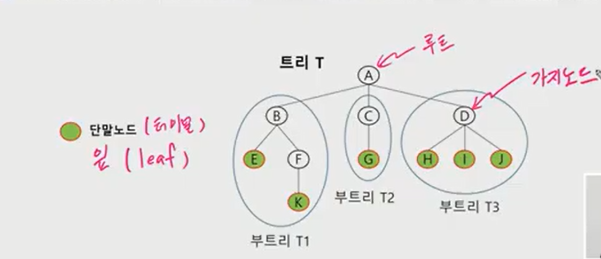
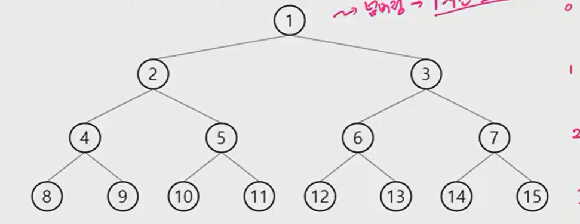
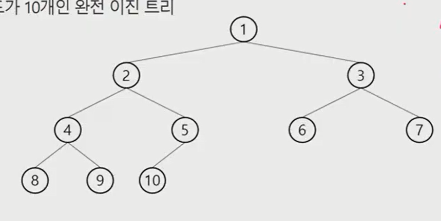
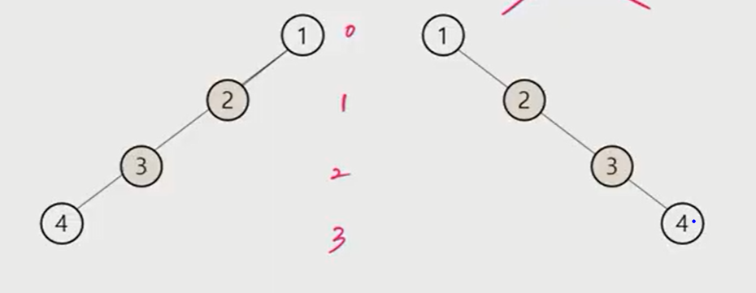
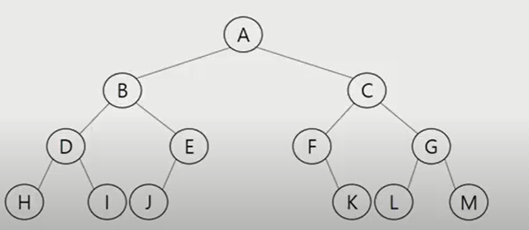
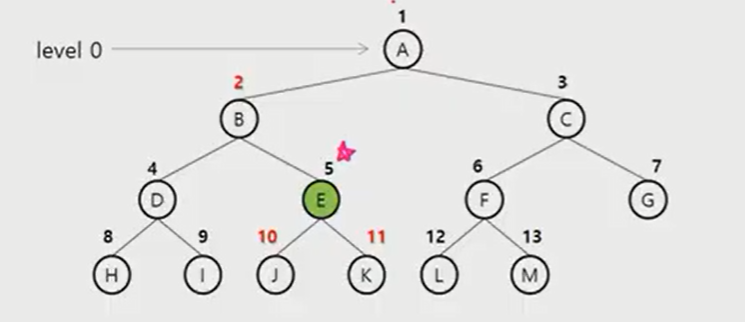
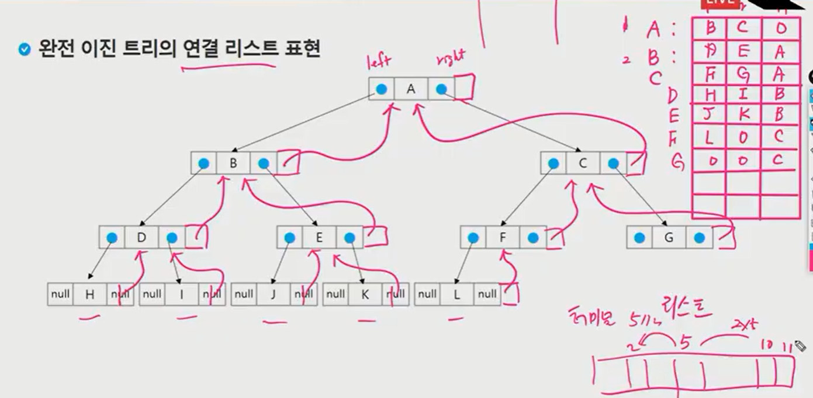
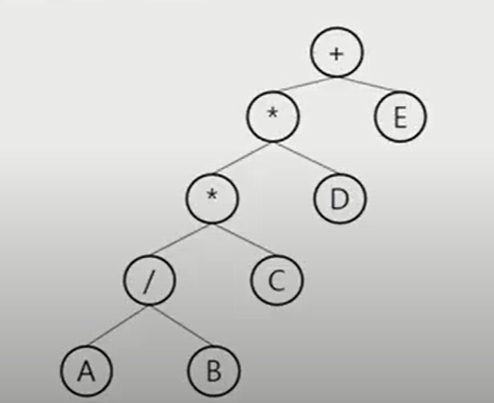
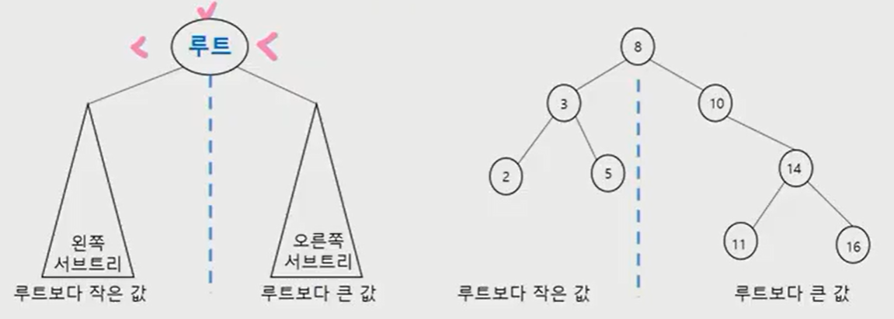

[toc]

# 0909 Algorithm :: Tree

## 정리

|                | 선형구조 | 비선형구조                                        | 비선형구조                                 |
| -------------- | -------- | ------------------------------------------------- | ------------------------------------------ |
|                | 1:1      | 이진트리(1:N)                                     | 그래프(N:N)                                |
| 표현방법(저장) | list     | 1차원 배열<br>2차원 배열(인접리스트)              | 인접행렬<br>인접리스트<br>간선배열         |
| 순회           | for문    | 전위 <br>중위<br>후위<br>visit이 필요 없음        | DFS(stack)<br>BFS(Queue)<br>visit이 필요함 |
| 유형           | IM문제   |                                                   | A형<br>완전검색 + 가지치기                 |
|                |          | 그래프 중에서 cycle이 없는 것을 이진트리라고 한다 | 재귀, 부분집합<br>순열 ,조합               |

* DFS

  > Stack Overflow를 고민해야 함
  >
  > 함수 호출 1,000개 정도

  ```python
  def dfs(V):
      visited[v] = 1
      print(v,end=' ')
      for w in range(1,v+1):
          if G[v][w] == 1 and visited[w] == 0:
              dfs(w)
  G = [[list(map(int,input()))]*(N+1) for _ in range(N+1)]
  visited = [0] * (N+1)
  dfs(1)
  ```

* BFS

  ```python
  def bfs(v):
      q = []
      q.append(v)
      visited[v] = 1
      print(v,end=' ')
      while q:
          v = q.pop(0)
          for w in G[v]:
              if not visited[w]:
                  q.append(w)
                  visited[w] = visited[v] + 1
                  print(w,end=" ")
  G = [[] for _ in range(N+1)]
  visited = [0] * (N+1)
  bfs(1)
  ```

  

## 트리

* 트리
  * 개념 종류
* 이진 트리
  * 표현방법, 순회
* 이진탐색 트리
* 힙
  * 우선순위 큐
* 실습1,2


## 트리

### 트리의 개념

* 비선형 구조
* 원소들 간에 1:n 관계를 가지는 자료구조
* 원소들 간에 계층관계를 가지는 계층형 자료구조
* 상위 원소에서 하위 원소로 내려가면서 확장되는 트리(나무)모양의 구조


### 트리의 정의

* 한 개 이상의 노드로 이루어진 유한집합이며 다음 조건을 만족함
  * 노드 중 최상위 노드를 루트(root)라 한다.
  * 노드, vortex
    * 트리의 원소
  * 간선, edge
    * 노드를 연결하는 선
  * 나머지 노드들은 n(<=0)개의 분리 집합 T1,...,TN으로 분리될 수 있다.
* 이들 T1, ... , TN은 각각 하나의 트리가 되며 (재귀적 정의) 루트의 부 트리(subtree)라 한다.
  * 루트
  * 가지노드
  * 단말노드, 터미널, 잎노드




### 트리 - 용어정리

* 루트노드: A

* 형제 노드(sibling node) - 같은 부모 노드의 자식 노드들

  * B,C,D,는 형제노드

* 조상 노드 - 간선을 따라 루트 노드까지 이르는 경로에 있는 모든 노드들

  * K의 조상 노드: F,B,A

* 서브 트리(subtree) - 부모 노드와 연결된 간선을 끊었을 때 생성되는 트리

* 자손 노드 - 서브 트리에 있는 하위 레벨의 노드들

  * B의 자손 노드 - E,F,K

  * E,F,K의 공통 조상 노드: B
  * B의 형제 노드: C,D
  * H,I,J의 가까운 공통 조상: D

* 차수(degree)
  * 노드의 차수: 노드에 연결된 자식 노드의 수
    * B의 차수=2, C의 차수=1
  * 트리의 차수: 트리에 있는 노드의 차수 중에서 가장 큰 값
    * 트리 T의 차수=3
  * 단말 노드(리프 노드): 차수가 0인 노드, 자식 노드가 없는 노드
* 높이
  * 노드의 높이: 루트에서 노드에 이르는 간선의 수. 노드의 레벨
    * B의 높이=1, F의 높이=2
  * 트리의 높이: 트리에 있는 노드의 높이 중에서 가장 큰 값. 최대 레벨
    * 트리 T의 높이=3
* 너비
  * 노드 개수


## 이진트리

* 모든 노드들이 2개의 서브트리를 갖는 특별한 형태의 트리
* 각 노드가 자식 노드를 최대한 2개까지만 가질 수 있는 트리
  * 왼쪽 자식 노드
  * 오른쪽 자식 노드
* 이진 트리 예
  * 루트만 존재하는 트리
  * 왼쪽 자식만 존재하는 트리
  * 오른쪽 자식만 존재하는 트리
  * 오른쪽 자식의 자손과 왼쪽 자식만 존재하는 트리

### 이진트리:: 특성

* 레벨 i에서의 노드의 최대 개수는 2**i개
* 높이가 h인 이진 트리가 가질 수 있는 노드의 최대 개수는 h+1개가 되며, 최대개수는 (2**(h+1)-1)개가 된다.
  * 높이는 0부터 시작함

### 이진트리 - 종류

* 포화 이진 트리(Full Binary Tree)

  * 모든 레벨에 노드가 포화 상태로 차 있는 이진 트리
  * 높이가 h일 때, 최대의 노드 개수인(2**(h+1)-1)의 노드를 가진 이진 트리
    * 높이 3일 때 2**(3+1)-1=15개의 노드
  * 루트를 1번으로 하여 (2**(h+1)-1)까지 정해진 위치에 대한 노드 번호를 가짐
    * 넘버링, 1차원 Index로 저장할 떄 노드 번호를 사용함

  

* 완전 이진트리(Complete Binary Tree)

  * 높이가 h이고 노드 수가 n개일 때(단, h+1 <= n < 2**(h+1)-1), 포화 이진 트리의 노드 번호 1번부터 n번까지 빈 자리가 없는 이진 트리
  * 예) 노드가 10개인 완전 이진 트리
    * 높이는 3으로 15개까지 존재할 수 있으나 
    * 10번까지의 노드가 비어있지 않음

  

* 편향 이진 트리(Skewed Binary Tree)
  * 높이 h에 대한 최소 개수의 노드를 가지면서 한쪽 방향의 자식들만을 가진 이진트리
    * 왼쪽 편향 이진 트리
    * 오른쪽 편향 이진 트리



### 이진트리 - 순회(traversal)

* 순회(traversal)란 트리의 각 노드를 중복되지 않게 전부 방문(visit) 하는 것을 말하는 데 트리는 비 선형구조이기 때문에 선형구조에서와 같이 선후 연결관계를 알 수 없다.
* 순회: 트리의 노드들을 체계적으로 방문하는 것
* 3가지 기본 순회 방법
  * 전위순회(preorder traversal):VLR
    * 부모노드 방문 후, 자식 노드를 좌,우 순서로 방문한다.
  * 중위순회(inorder traversal):LVR
    * 왼쪽 자식노드, 부모노드, 오른쪽 자식노드 순으로 방문한다.
  * 후위순회(postorder traversal):LRV
    * 자식 노드를 좌우 순서로 방문한 후, 부모노드로 방문한다.

#### 전위순회(preorder traversal)

* 수행방법

  * 1) 현재 노드 n을 방문하여 처리한다. => V
  * 2) 현재 노드 n의 왼쪽 서브트리로 이동한다. => L
  * 3) 현재 노드 n의 오른쪽 서브트리로 이동한다. => R

* 전위순회 알고리즘

  ```python
  def preorder_traverse(T): #전위순회
      if T: # T is not note
          # 루트 노드 방문, #print(T.item)
          visit(T) # 사실상 2개 중 한 개, 뒤에서 visit처리 불필요
          preorder_traverse(T.left)
          preorder_traverse(T.right)
  ```

#### 중위 순회(inorder traversal)

* 수행 방법

  * 1) 현재 노드 n의 왼쪽 서브트리로 이동한다.:L
  * 2) 현재 노드 n을 방문하여 처리한다.:V
  * 3) 현재 노드 n의 오른쪽 서브트리로 이동한다.:R

* 중위 순회 알고리즘

  ```python
  def inorder_traverse(T): #전위순회
      if T: # T is not note
          inorder_traverse(T.left)
          visit(T) # 노드 방문, #print(T.item)
          inorder_traverse(T.right)
  ```

#### 후위 순회(postorder traversal)

> 많이 쓰이는 방법, 카드 카운팅 등

* 수행 방법

  * 1) 현재 노드 n의 왼쪽 서브트리로 이동한다.:L
  * 2) 현재 노드 n의 오른쪽 서브트리로 이동한다.:R
  * 3) 현재 노드 n을 방문하여 처리한다.:V

* 후위 순회 알고리즘

  * 내려 갈 만큼 내려간 다음, 갈 곳이 없을 때 visit을 찍는 것

  ```python
  def postorder_traverse(T): #전위순회
      if T: # T is not note
          postorder_traverse(T.left)
          postorder_traverse(T.right)
          visit(T) # 노드 방문, #print(T.item)
  ```

### 이진트리 - 순회 연습 문제



| 0    | 1    | 2    | 3    | 4    | 5    | 6    | 7    | 8    | 9    | 10   | 11   | 12   | 13   |
| ---- | ---- | ---- | ---- | ---- | ---- | ---- | ---- | ---- | ---- | ---- | ---- | ---- | ---- |
| 전위 | A    | B    | D    | H    | I    | E    | J    | C    | F    | K    | G    | L    | M    |
| 중위 | H    | D    | I    | B    | J    | E    | A    | C    | F    | K    | G    | L    | M    |
| 후위 | H    | I    | D    | J    | E    | B    | K    | F    | L    | M    | G    | C    | A    |


### 이진트리의 표현

---

* 배열을 이용한 이진트리의 표현
  * 이진 트리에 각 노드 번호를 다음과 같이 부여
  * 루트의 번호를 1로 함
  * 레벨 n에 있는 노드에 대하여 왼쪽부터 오른쪽으로 2 ** n 부터 2 **(n+1)-1까지 번호를 차례로 부여
* 노드 번호의 성질
  * 노드 번호가 i인 노드의 부모 노드 번호? `i//2`
    * 5//2 = 2
  * 노드 번호가 i인 노드의 왼쪽 자식 노드 번호? `2*i`
  * 노드 번호가 i인 노드의 오른쪽 자식 노드 번호? `2*i+1`
  * 레벨 n의 노드 시작 번호는? `2**n`
    * 높이가 3인 경우, 8부터 시작



* 노드 번호를 배열의 인덱스로 사용
* 높이가 h인 이진트리를 위한 배열의 크기는?
  * 레벨 i의 최대 노드 수는? 2**i
  * 따라서 1+2+4+8+ .. + 2 ** i = 2 ** (h+1) - 1
    * 점화식
  * 포화 이진트리인 경우에 해당
* 편향 이진트리의 경우, 배열이 다수가 sparse matrix 문제
  * 0이 너무 많으며 메모리 낭비에 해당함
* 배열을 이용한 이진 트리의 표현의 당점
  * 편향 이진 트리의 경우에 사용하지 않는 배열 원소에 대한 메모리공간 낭비 발생
  * 트리의 중간에 새로운 노드를 삽입하거나 기존의 노드를 삭제할 경우 배열의 크기 변경이 어려워 비효율적
    * C,java이야기

### 트리의 표현- 연결리스트

* 배열을 이용한 이진 트리의 표현의 단점을 보완하기 위해 연결리스트를 이용하여 트리를 표현할 수 있다

  * 자기 참조 구조체

* 연결 자료 구조를 이용한 이진트리의 표현

  * 이진 트리의 모든 노드는 최대 2개의 자식 노드를 가지므로 일정한 구조의 단순 연결 리스트 노드를 사용하여 구현

    | left            | 데이터 | right             |
    | --------------- | ------ | ----------------- |
    | 왼쪽 자식(참조) |        | 오른쪽 자식(참조) |

    | left | 데이터 | right | 부모 |
    | ---- | ------ | ----- | ---- |
    | 참조 |        | 참조  | 참조 |

  


### 연습문제

> 첫 줄에는 트리 정점의 총 수 V, 그 다음 줄에는 간선 수 V-1
>
> 간선 순서는 '부모-자식'
>
> > 간선은 부모 정점 부호가 작은 것부터 나열
> >
> > 부모 정점이 동일하면 자식 정점 번호가 작은 것부터 나열

* 다음 이진 트리 표현에 대해 전위 순회하여 정점 번호를 출력하시오
  * 13: 정점의 개수
  * 1 2 1 3 2 4 3 5 3 6 4 7 5 8 5 9 6 10 6 11 7 12 11 13

|      | 1    | 2    | 3    | 4    | 5    | 6    | 7    | 8    | 9    | 10   | 11   | 12   | 13   |
| ---- | ---- | ---- | ---- | ---- | ---- | ---- | ---- | ---- | ---- | ---- | ---- | ---- | ---- |
| 왼   | 2    | 4    | 5    | 7    | 8    | 10   | 12   |      |      |      | 13   |      |      |
| 오   | 3    |      | 6    |      | 9    | 11   |      |      |      |      |      |      |      |
| 부모 | 0    | 1    | 1    | 2    | 3    | 3    | 4    | 5    | 5    | 6    | 6    | 7    | 11   |

```python
s,e = 1,2
if tree[s][0] == 0:
    tree[s][0] = e
else:
    tree[s][1] = e
tree[e][2] = s
```

```python

```

* 공통 조상 찾기가 수월함(SWEA 1248)
  * 부모 노드의 정보 기억하기

|      | left(0) | right(1) | parent(2) |
| ---- | ------- | -------- | --------- |
| 1    | 2       | 3        |           |
| 2    | 4       |          | 1         |
| 3    | 5       | 6        | 1         |
| 4    | 7       |          | 2         |
| 5    | 8       | 9        | 3         |
| 6    | 10      | 11       | 3         |
| 7    | 12      |          | 4         |
| 8    |         |          | 5         |
| 9    |         |          | 5         |
| 10   |         |          | 6         |
| 11   | 13      |          | 6         |
| 12   |         |          | 7         |
| 13   |         |          | 11        |


### 수식트리

* 수식을 표현하는 이진 트리
* 수식 이진 트리(Expression Binary Tree)라고 부르기도 함
* 연산자는 루트 노드 혹은 가지 노드
* 피 연산자는 모두 잎 노드
  * 계산기: 중위 -> 후위(stack), 후위-> 계산(stack)

#### 수식트리의 순회

* 중위 순회: A/B * C * D + E (식의 중위 표기)
* 전위 순회: +**/ABCDE(식의 전위 표기)
* 후위 순회: A B / C * D * E + (식의 후위 표기)




### 이진 탐색 트리

* 탐색 작업을 효율적으로 하기 위한 자료구조
* 조건: 모든 원소는 서로 다른 유일한 키를 갖는다
* key(왼쪽 서브트리) < key(루트 노드) < key(오른쪽 서브 트리)
* 왼쪽 서브 트리와 오른쪽 서브 트리도 이진 탐색 트리
* 중위 순회하면 오른차순 정렬 값을 얻음



### 이진탐색 트리 - 연산

* 탐색 연산
  * 루트에서 시작
  * 탐색할 키 값 x를 루트 노드의 키 값과 비교
    * 크면 오른쪽, 작으면 왼쪽, 같으면 성공
    * 서브트리에 대해 순환적으로 탐색 연산 반복
* 삽입 연산
  * 먼저 탐색 연산 수행
    * 삽입 할 원소와 같은 원소가 트리에 있으면 삽입 불가
    * 탐색 실패가 결정되는 위치가 삽입위치
  * 원소 삽입
* 삭제 연산
  * 단말 노드 삭제
  * 가지 노드 -> 바로 올려버리기
  * 루트 -> 값을 비교하여 결정 

#### 이진 탐색 트리 - 성능

* 탐색, 삽입, 삭제 시간은 트리 높이 만큼 시간이 걸림
  * O(h)
* 평균의 경우
  * 이진 트리가 균형적으로 생성
  * O(logn)
* 최악의 경우
  * 한쪽으로 치우친 경사 이진트리
  * O(n)
* 검색 알고리즘 비교
  * 배열 순차 검색 O(N)
  * 정렬 배열 순차 검색 O(N)
  * 정렬 배열 이진 탐색 O(logN)
  * 이진 탐색트리 평균 O(logN)
    * 최악은 O(N)
    * 완전 이진트리, 균형트리로 바꾸면 최악의 경우 없앨 수 있음
  * 해쉬 O(1)
    * 추가 저장 공간이 필요

## 힙(heap)

* 완전 이진트리에 있는 노드 중에서 키 값이 가장 큰 노드나 키값이 가장 작은 노드를 찾기 위해서 만든 자료구조

  > 포화 이진 트리 - 번호를 붙인 것도 완전 이진트리의 일종
  >
  > 우선순위 큐 사용

* 최대 힙(max heap)

  * 키값이 가장 큰 노드를 찾기 위한 완전 이진 트리
  * (부모 노드의 키 값 > 자식 노드의 키 값)
  * 루트 코드: 키값이 가장 큰 노드

* 최소 힙(min heap)

  * 키값이 가장 큰 노드를 찾기 위한 완전 이진 트리
  * {부모 노드의 키값 < 자식 노드의 키 값}
  * 루트 노드: 키값이 가장 작은 노드

* 힙검사

  * 1) 완전 이진트리가 아닌 경우
  * 2) 루트 값이 최대/최소가 아닌 경우
  * 3) 부모, 자식 관계의 역전이 있는 경우

* 힙 연산 - 삽입

  * 삽입 시 부모 노드와 대소를 비교하여 값의 순서를 맞추어 밀어내며 삽입

* 힙 연산 - 삭제

  * 힙에서는 루트 노드의 원소만 삭제할 수 있다
  * 루트 노드의 원소를 삭제하여 반환한다
  * 힙의 종류에 따라 최대값/최소값

* 힙 정렬
  
  * O(nlogn)

